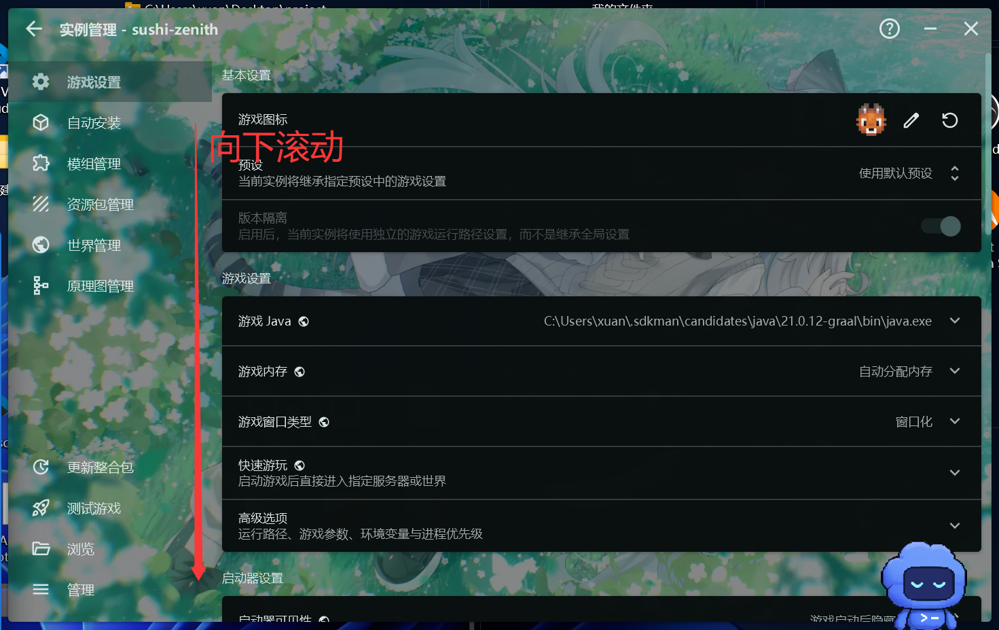
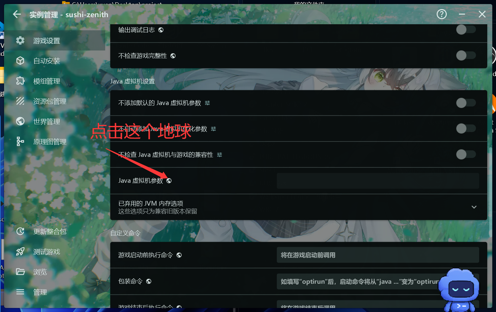
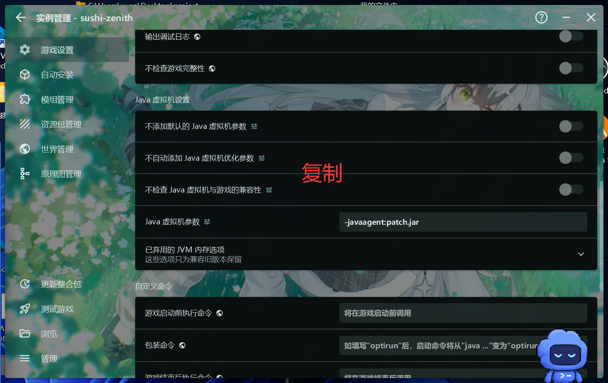

# 苍穹

<!-- 玩法简介 -->

寿司峰：苍穹 公测版发布于 2026年7月19日，以养老，探索，建筑为玩法主题。该服务器玩法目前仍在积极建设中。

---

## 进服指南 {#guide-join}

> 该指南将帮助您安装 寿司峰：苍穹 整合包，并调整好必要的设置。

### 安装整合包

首先访问寿司峰玩家 **QQ 群：`1045084460`**

在群文件中，您可以找到整合包文件夹。在文件夹中找到"苍穹"，并**下载最新版本**。

然后，**将整合包安装到您的 Minecraft 启动器中**。对于启动器安装整合包的方式，请您单独查阅启动器文档。一般来说，用鼠标将整合包文件拖入启动器窗口即可。

整合包安装**需要联网**。如果您无法正常下载游戏文件和模组文件，请重试几次。

!!! note "关于启动器"

    官方启动器无法安装第三方整合包。如果您使用官方启动器，建议尽快换成诸如 PCL2、HMCL 等热门第三方启动器。（现在真的还有人用官启吗😅）

### 设置整合包

  安装好后，请在整合包版本设置的`高级设置`中找到`JVM参数`，并输入：

```JVM
-javaagent:patch.jar
```

一些启动器的设置位置如下：

#### PCL2 设置步骤

① 选择版本


② 打开高级设置


③ 找到 JVM 参数


#### HMCL 设置步骤

① 选择版本


② 打开高级设置，找到 JVM 参数







这些参数会让您的游戏连接到寿司峰更新服务，并保持您的客户端是最新版。

!!! note "自己的启动器没有上述设置？"
    由于启动器版本不同，您的启动器页面可能与上述图示中略有偏差。如果不确定如何修改设置，您可以在玩家群中询问。

!!! warning "一些注意事项"
    1. 记得把上述JVM参数设置在整合包版本设置里。如果您把它填进全局设置里，您就玩不了除寿司峰以外的其他版本了。
    2. 对于 Windows 操作系统，整合包安装的路径中**只能包含英文字符**。也就是说，您的 .minecraft 文件夹的绝对路径**不能包含中文**。如果必须包含（比如您的用户名包含中文），请参见下方[相关服务](zenith.md#update-service)章节。

### 选择登录方式

为了安全和兼容性，寿司峰：苍穹 仅支持 [LittleSkin](https://littleskin.cn) 登录。

如果您是正版玩家，您可以前往 LittleSkin 网站，将您的正版账号绑定到 LittleSkin。

如果您没有正版账户，您也可以在 LittleSkin 注册免费的账户并加入服务器游玩。

完成上述设置后，您就可以启动 寿司峰™苍穹 整合包了。

---

## 相关服务

> 您可以在这里找到 寿司峰：苍穹 面向玩家开放的一些相关服务。

### 寿司峰更新服务 {#update-service}

如果您按照 [进服指南](#guide-join) 设置了 JVM 参数，您的客户端会在游戏启动时**自动检查更新**。这会保证您的客户端始终与最新版 寿司峰：苍穹 整合包同步，您不需要在每次更新时重新安装整合包。

!!! warning "更新服务异常"

    如果您的更新服务出现问题，您会在游戏启动时看到错误窗口。对于这些问题，请在玩家 QQ 群中礼貌询问，寻求解决办法。
    
    如果您的 .minecraft 路径中有中文，那么您将无法使用自动更新服务。此时，您可以打开版本文件夹，双击运行 `update.exe` 来完成更新。
    
    
### 网页地图

您可以访问 [网页地图](https://zenith.map.sushimc.top) 查看生存模式服务器的实时地图。
创造模式服务器暂无地图开放。

---

## 快速导航

> 您可以点击下面的链接，查看 寿司峰：苍穹 的其他相关指南。

[基础游戏指南](zenith-game.md)

[高级选项](zenith-advanced.md)

[已知漏洞和问题（建议细看！）](zenith-known-bugs.md)
